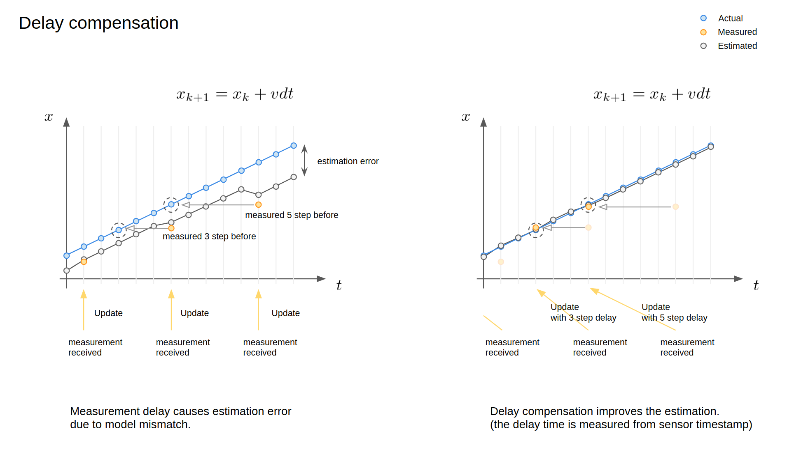
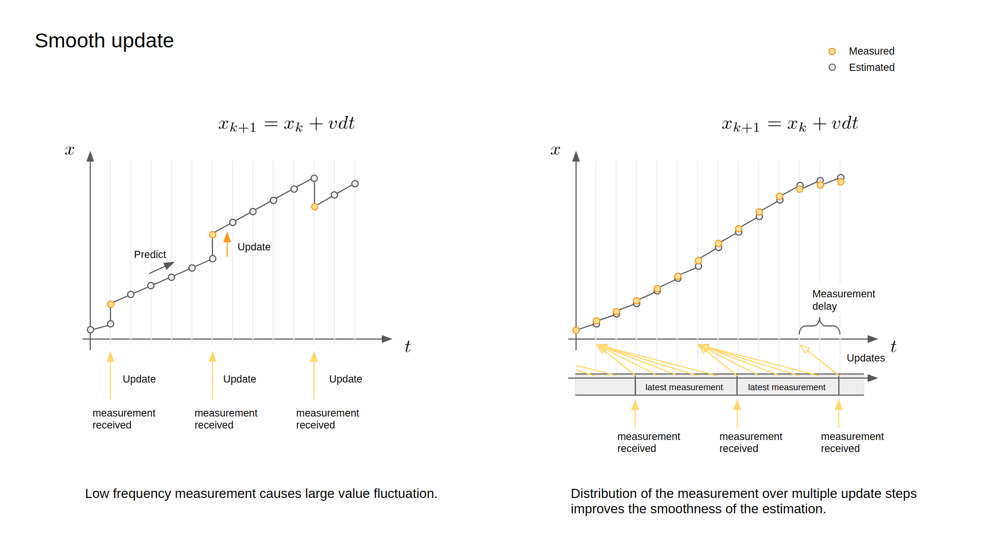

# Overview

The **Extend Kalman Filter Localizer** estimates robust and less noisy robot pose and twist by integrating the 2D vehicle dynamics model with input ego-pose and ego-twist messages. The algorithm is designed especially for fast moving robot such as autonomous driving system.

## Flowchart

The overall flowchart of the ekf_localizer is described below.

  

## Features
This package includes the following features:

 - **Time delay compensation** for input messages, which enables proper integration of input information with varying time delay. This is important especially for high speed moving robot, such as autonomous driving vehicle. (see following figure). 
- **Automatic estimation of yaw bias** prevents modeling errors caused by sensor mounting angle errors, which can improve estimation accuracy.
- **Mahalanobis distance gate** enables probabilistic outlier detection to determine which inputs should be used or ignored.
- **Smooth update**, the Kalman Filter measurement update is typically performed when a measurement is obtained, but it can cause large changes in the estimated value especially for low frequency measurements. Since the algorithm can consider the measurement time, the measurement data can be divided into multiple pieces and integrated smoothly while maintaining consistency (see following figure).

####

  

