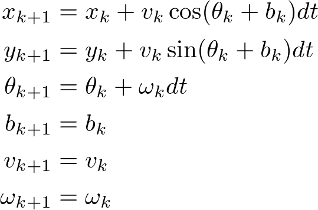

# 施工中...
---
# 简介

The **Extend Kalman Filter Localizer** estimates robust and less noisy robot pose and twist by integrating the 2D vehicle dynamics model with input ego-pose and ego-twist messages. The algorithm is designed especially for fast moving robot such as autonomous driving system.


## Flowchart

总体流程图如下所述。

<p align="center">
  
</p>


## 特性


 - 对输入消息的**时间延迟补偿**, 可以在``不同的时间延迟下正确集成输入信息`` 对于速度搞的机器人比较重要（查看对应图）.
- **YAW偏差的自动估计** 可防止由于传感器安装角度误差引起的建模误差，从而可以提高估计精度.
- **Mahalanobis 距离阀值** 自动检测离群点，相当于预处理，被抛弃的离群点不参与协方差迭代。
- **Smooth update**, 通常在获得测量值时执行卡尔曼滤波器测量值更新，但是它可能导致估计值发生较大变化，尤其是对于低频测量而言。由于该算法可以考虑测量时间，因此可以在保持一致性的同时将测量数据分为多个部分并进行平滑集成（参见下图）。


<p align="center">

</p>

####

<p align="center">
  
</p>

## 启动
>默认参数启动,更多参数设置参见launch文件或者source code 节点初始化部分.
```xml
roslaunch ekf_localizer ekf_localizer.launch
```
---
# 节点参数

## 订阅的话题
`measured_pose_with_covariance`（geometry_msgs/PoseWithCovarianceStamped）

* 具有测量协方差矩阵的输入pose，当`use_pose_with_covariance`为`true` 时使用。

`measured_twist_with_covariance`（geometry_msgs/PoseWithCovarianceStamped）

* 输入twist和twist测量协方差矩阵，当`use_twist_with_covariance`为`true` 时使用。

 `measured_pose`（geometry_msgs/PoseStamped）

* 输入pose，当`use_pose_with_covariance`为`false`时使用。

`measured_twist`（geometry_msgs/TwistStamped）

* 输入twist，当`use_twist_with_covariance`为`false` 时使用。

`initialpose`（geometry_msgs/PoseWithCovarianceStamped）

* EKF的初始姿势。估计的姿态在开始时以零初始化。`每当发布时，都会使用此消息进行初始化`。

## 发布的话题
`ekf_pose` (geometry_msgs/PoseStamped)

* Estimated pose.

`ekf_pose_with_covariance` (geometry_msgs/PoseWithCovarianceStamped)

* Estimated pose with covariance.

`ekf_twist` (geometry_msgs/TwistStamped)

* Estimated twist.

`ekf_twist_with_covariance` (geometry_msgs/TwistWithCovarianceStamped)

* Estimated twist with covariance.
## TF 
### 父节点：/map
### 子节点：/ekf_pose
---
## EKF建模
#### kinematics model in update function


where `b_k` is the yaw-bias.

### time delay model

